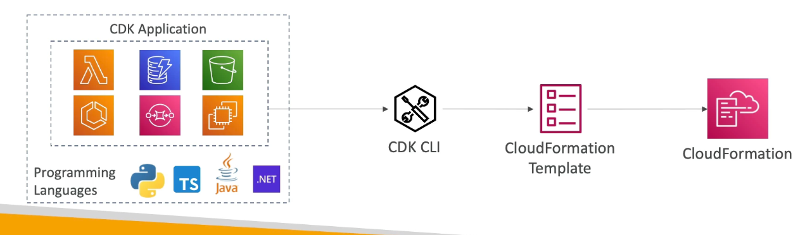

## AWS README PAGE 2

# DEPLOYMENT SCALE AND MANAGING INFRASTRUCTURE

## CLOUD FORMATION

- **It is a declarative way of outlining AWS infrastructure**
- Benefits are:
    - Infrastructure as code - No resources are created manually
    - Cost - Resource creation and termination can be automated
    - Generated diagram for our template
    - Leverage existing templates

## AWS CLOUD DEVELOPMENT KIT (CDK)
- Defining **cloud infrastructure using a familiar coding language**
- Code is **compiled into a cloudformation template**

