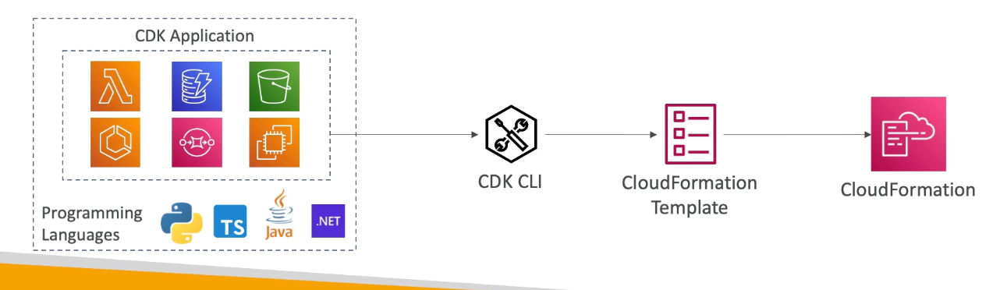
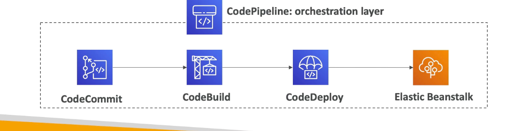
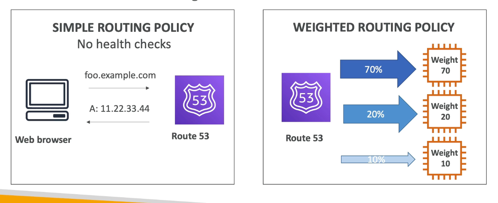
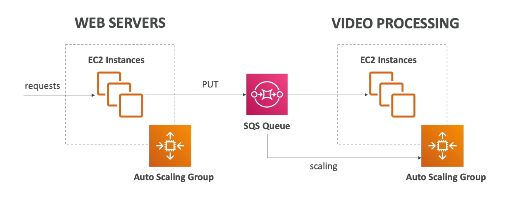
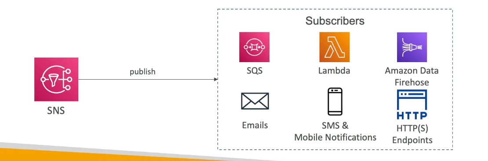
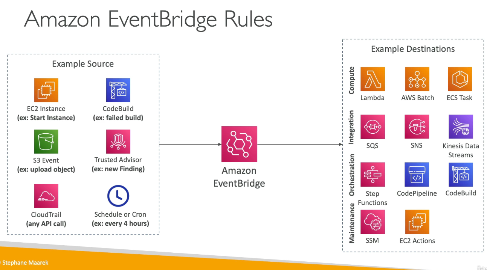
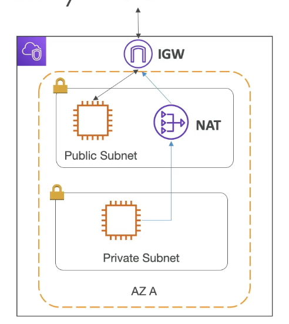

## AWS README PAGE 2

# DEPLOYMENT SCALE AND MANAGING INFRASTRUCTURE

## CLOUD FORMATION

- **It is a declarative way of outlining AWS infrastructure**
- Benefits are:
    - **    **
    - Cost - Resource creation and termination can be automated
    - Generated diagram for our template
    - Leverage existing templates

## AWS CLOUD DEVELOPMENT KIT (CDK)
- Defining **cloud infrastructure using a familiar coding language**
- Code is **compiled into a cloudformation template**

## AWS ELASTIC BEANSTALK - PaaS
- Generally we make use of 3 tier for Web application, that is, ELB -> EC2 -> DB
- Elastic beanstalk is a **developer centric view of deploying an application to AWS**
- **BEANSTALK - PaaS**
- Here **developer is managing the code while AWS is responsible for deployments and managing**
- **ELASTIC BEANSTALK HAS ITS OWN HEALTH MONITORING** 

## AWS CODE DEPLOY
- It is a **HYBRID SERVICE - ONPREM AND CLOUD**
- It is a way to **deploy application automatically**
- It helps in **UPGRADING APPLICATIONS FROM V1 TO V2 IN FEW CLICKS**

## AWS CODECOMMIT
- It is a **code repository, using the git technology**
- CodeCommit is a way of **storing code before moving it to deployment in AWS**
- Private, secure

## AWS CODEBUILD
- **SERVERLESS**
- Build code in the cloud
- **Compile source code, test and the output which is a package can be deployed**
- **PAY FOR TIME USED TO BUILD THE CODE**

## AWS CODEPIPELINE
- **We can connect CodeCommit and CodeBuild using a CodePipeline**
- It is basis for **CI/CD**
- Code -> Build -> Test -> Deploy

## OVERALL WORKFLOW

## AWS CODE ARTIFACT

- Storing and retrieving these dependencies is called **ARTIFACT MANAGEMENT**
- **Developers and CodeBuild can retrieve dependencies from CodeArtifact**

## AWS SSM - SYSTEM MANAGER
- Manage **Fleet of EC2 instances in On-prem and cloud**
- It is **HYBRID**
- We can do **AUTOMATED PATCHING**
- We need to install **SSM agent in EC2**

## AWS SSM Parameter Store
- **SERVERLESS**
- **Secure storage for configuration and secrets**
- **Version tracking and encryption is there**

# GLOBAL INFRASTRUCTURE 
- Deploying application in multiple regions or Edge locations mkaing it a global application 
- Reasons:
    - Decreased Latency
    - Disaster recovery 
    - Attack protection

## AMAZON ROUTE 53
- It is a managed DNS(Domain name system)
- It helps find client reach their right destination by providing IP address

### ROUTING POLICIES:
1. **SIMPLE ROUTING POLICY**
- No health checks 
-  simple goes to DNS and gets the IP

2. **WEIGHTED ROUTING POLICY**
- We do have health-checks
-  allows us to distribute weights acorss multiple EC2 instances

3. **LATENCY ROUTING POLICY**
- Checks for user location and redirects user request to nearest server 

4. **FAILOVER ROUTING POLICY**
- we will have primary and Failover instances
- DNS performs a health check on primary and then routes to failover if primary is unhealthy 

## CLOUDFRONT OVERVIEW
- It is a CDN - CONTENT DELIVERY NETWORK
- it **caches the content across Points of presence or Edge locations**
- We get **DDoS protection**
- Cloudfront has origins like S3, so for the first time. Edge location gets from origin and stores in cache for the next times 

## AWS S3 TRANSFER ACCELERATOR
- Increase uploads and downloads for S3 bucket
- When we need to upload a file from Australia to a bucket in England, then during the process it gets uploaded to a edge location first and through a **internal network** it gets uploaded to bucket in England super fast

## AWS GLOBAL ACCELERATOR
- Here we leverage, **AWS internal network to optmize the route to our application**
- We access applications through **static IP**
- We **connect to an Edge location and from there we move internal**

## AWS OUTPOSTS
- It is about HYBRID CLOUD
- **Outposts are server racks that offers same AWS infrastructuree services on On-prem**
- **AWS will setup and manage**
- But we will be responsible for security of the server racks 

## AWS WAVELENGTH
- Able to deploy few AWS services on edge of 5G networks
- ultra-low latency through 5G networks

## AWS LOCAL ZONES
**EXTEND VPC's IN A REGION TO LOCAL ZONES**
- **Place AWS compute storage or databases closer to users**
- Extend your VPC to more locations **Extension of AWS regions**
- Basically, we can extend a local zone for a region and then host our EC2 there for better latency and availability

# CLOUD INTEGRATIONS
- There are 2 ways of application communicating eachother:
    1. Synchronous communication (Application to Application)
    2. Asynchronous/Event based (Application -> Queue -> Application)

## AWS SQS
- SQS = Simple Queue Service
- Producers send messages to Queue and once it is stored in queue, consumer can poll these messages and complete the work
- Once completed, the message will be deleted in the queue
- **SERVERLESS**
- It is used to **DECOUPLE APPLICATIONS**
- default retention is **4 days to 14 days**
- **It used FIFO - FIRST IN FIRST OUT**
- Example:

## AWS KINESIS DATASTREAM
- It is used to **collect and analyze live streaming data**

## AWS SNS
- SNS = Simple notification service
- Sending a single message to thousands of users
- **PUB/SUB INTEGRATION**
- Publishers will send messages to **SINGLE SNS TOPIC** and **SUBSCRIBERS TO THAT SNS TOPIC** will get message from that 

## AMAZON MQ
- **SQS and SNS are cloud native**
- **On-Prem** makes use of **MQTT** etc.
- so **when migrated to cloud, to continue with those servers we make use of AMAZON MQ**

# CLOUD MONITORING 

## CLOUD WATCH METRICS
- Metrics are variable to monitor 
- metrics will have timestamps
- We can look at:
    - CPU utilization 
    - Status checks
    - Network

## AWS CLOUDWATCH ALARMS
- Trigger a cloud watch alarm for any metric 
- Alarm actions:
    - Auto scaling 
    - EC2 actions 
    - SNS notifications 
- We can create a billing alarm 

## CLOUDWATCH LOGS
- It is used to collect log files
- We can collect logs from:
    - EBS
    - ECS
    - Route53
- We can also retention the logs 

### CLOUD WATCH LOGS FOR EC2
- By default it will not send we need to install agent and then we can send what logs needs to be sent '

## EVENT BRIDGE 
- **schdeule Cron Jobs**
- We can react to event occuring and also for a service happening 
- Example: Give a alert to security group if a user is logging in through a Root user

## AWS CLOUDTRAIL
- It **provides, governance, compliance and audit for AWS account** 
- Everything that is done in an account will be logged in cloudtrail.
- We can send this to **S3 or CloudWatch logs**

## X-RAY OVERVIEW
- Debugging in production inlcudes reading logs and making fix and re-deploying 
- AWS **X-ray can do tracing and give visual representation of each services and see where it is failing **
- We can:
    - Troubleshooting 
    - Pinpoint service
    - Find errors and services
    - Identify users who are going to be impacted 

## AWS HEALTH DASHBOARD - SERVICE HISTORY
- Gives a health check on **AWS services across all regions **

## AWS HEALTH DASHBOARD - YOUR ACCOUNT 
- It provides alerts and remediation whe AWS is performing certain actions that will be affecting services in our account 
- Gives alert on schedules maintainence from AWS etc

# VPC AND NETWORKING 

## IP ADDRESSES IN AWS
- IPv4 - 4.3 billion addresses
- Ipv6 - almost unlimited (3.4 * 10^38)
- EC2 instances get new IP everytime we start and stop - **PUBLIC IP ADDRESS**

**Private IPv4 **- It is not public and will be the same even if we stop and restart and cannot be accessed by internet
- ### ELASTIC IP - Gets a fixed public IPv4 address to a Ec2 instance

- IPv6 is free on AWS while EIP and Ipv4 charges 0.005$

## VPC - VIRTUAL PRIVATE CLOUD
- **It is linked to a region**
- **Subnets** - **Part of a VPC and it will be associated to a AZ**
- Here we can have:
    1. **Public Subnet** - accessed by public
    2. **Private subnet** - cannot be accessed by public 

## INTERNET GATEWAY
- Helps VPC instances to connect to internet

## NAT GATEWAY
- allows instances to connect to internet using NAT GATEWAY
- NAT GATEWAY - converts private IP to public IP 

## NACL AND SECURITY GROUPS
1. ## NACL 
**- It is at VPC level 
- can allow or deny rules 
- they are not stateful 

2. ## SECURITY GROUPS
**- It is at instances level
**- they are stateful
**- support allow rules, everything else is explicitly denied**