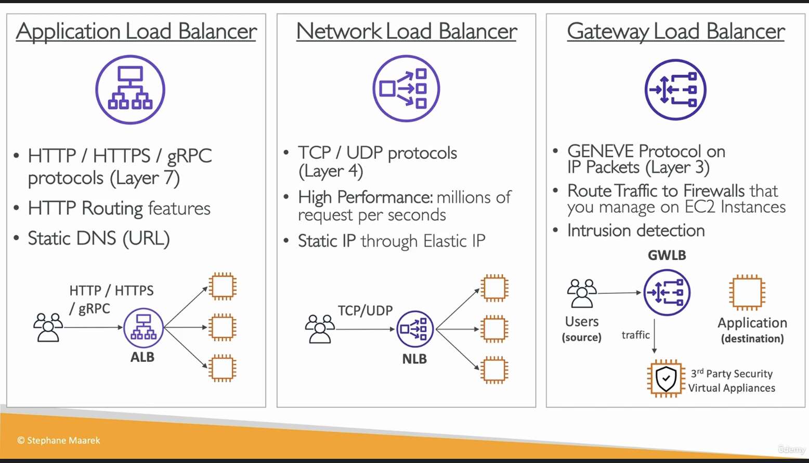
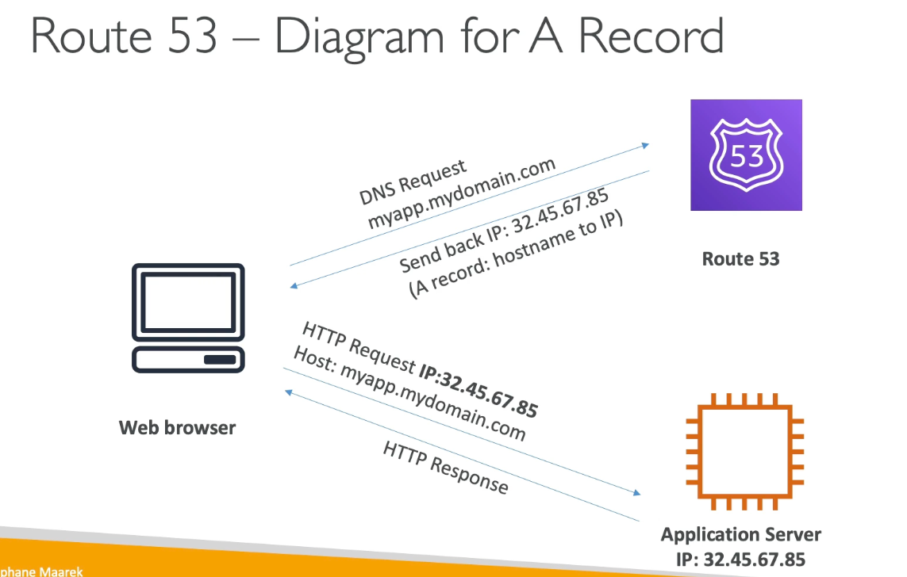

## AWS README PAGE 2

# DEPLOYMENT SCALE AND MANAGING INFRASTRUCTURE

## CLOUD FORMATION

- **It is a declarative way of outlining AWS infrastructure**
- Benefits are:
    - Infrastructure as code - No resources are created manually
    - Cost - Resource creation and termination can be automated
    - Generated diagram for our template
    - Leverage existing templates

## AWS CLOUD DEVELOPMENT KIT (CDK)
- Defining **cloud infrastructure using a familiar coding language**
- Code is **compiled into a cloudformation template**

## AWS ELASTIC BEANSTALK - PaaS
- Generally we make use of 3 tier for Web application, that is, ELB -> EC2 -> DB
- Elastic beanstalk is a **developer centric view of deploying an application to AWS**
- **BEANSTALK - PaaS**
- Here **developer is managing the code while AWS is responsible for deployments and managing**
- **ELASTIC BEANSTALK HAS ITS OWN HEALTH MONITORING** 

## AWS CODE DEPLOY
- It is a **HYBRID SERVICE - ONPREM AND CLOUD**
- It is a way to **deploy application automatically**
- It helps in **UPGRADING APPLICATIONS FROM V1 TO V2 IN FEW CLICKS**

## AWS CODECOMMIT
- It is a **code repository, using the git technology**
- CodeCommit is a way of **storing code before moving it to deployment in AWS**
- Private, secure

## AWS CODEBUILD
- **SERVERLESS**
- Build code in the cloud
- **Compile source code, test and the output which is a package can be deployed**
- **PAY FOR TIME USED TO BUILD THE CODE**

## AWS CODEPIPELINE
- **We can connect CodeCommit and CodeBuild using a CodePipeline**
- It is basis for **CI/CD**
- Code -> Build -> Test -> Deploy

## OVERALL WORKFLOW

## AWS CODE ARTIFACT

- Storing and retrieving these dependencies is called **ARTIFACT MANAGEMENT**
- **Developers and CodeBuild can retrieve dependencies from CodeArtifact**

## AWS SSM - SYSTEM MANAGER
- Manage **Fleet of EC2 instances in On-prem and cloud**
- It is **HYBRID**
- We can do **AUTOMATED PATCHING**
- We need to install **SSM agent in EC2**

## AWS SSM Parameter Store
- **SERVERLESS**
- **Secure storage for configuration and secrets**
- **Version tracking and encryption is there**

# GLOBAL INFRASTRUCTURE 
- Deploying application in multiple regions or Edge locations mkaing it a global application 
- Reasons:
    - Decreased Latency
    - Disaster recovery 
    - Attack protection

## AMAZON ROUTE 53
- It is a managed DNS(Domain name system)
- It helps find client reach their right destination by providing IP address

### ROUTING POLICIES:
1. **SIMPLE ROUTING POLICY**
- No health checks 
-  simple goes to DNS and gets the IP

2. **WEIGHTED ROUTING POLICY**
- We do have health-checks
-  allows us to distribute weights acorss multiple EC2 instances

3. **LATENCY ROUTING POLICY**
- Checks for user location and redirects user request to nearest server 

4. **FAILOVER ROUTING POLICY**
- we will have primary and Failover instances
- DNS performs a health check on primary and then routes to failover if primary is unhealthy 

## CLOUDFRONT OVERVIEW
- It is a CDN - CONTENT DELIVERY NETWORK
- it **caches the content across Points of presence or Edge locations**
- We get **DDoS protection**
- Cloudfront has origins like S3, so for the first time. Edge location gets from origin and stores in cache for the next times 

## AWS S3 TRANSFER ACCELERATOR
- Increase uploads and downloads for S3 bucket
- When we need to upload a file from Australia to a bucket in England, then during the process it gets uploaded to a edge location first and through a **internal network** it gets uploaded to bucket in England super fast

## AWS GLOBAL ACCELERATOR
- Here we leverage, **AWS internal network to optmize the route to our application**
- We access applications through **static IP**
- We **connect to an Edge location and from there we move internal**

## AWS OUTPOSTS
- It is about HYBRID CLOUD
- **Outposts are server racks that offers same AWS infrastructuree services on On-prem**
- **AWS will setup and manage**
- But we will be responsible for security of the server racks 

## AWS WAVELENGTH
- Able to deploy few AWS services on edge of 5G networks
- ultra-low latency through 5G networks
