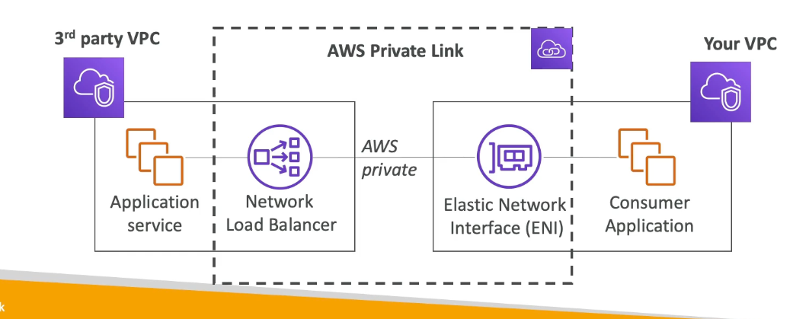
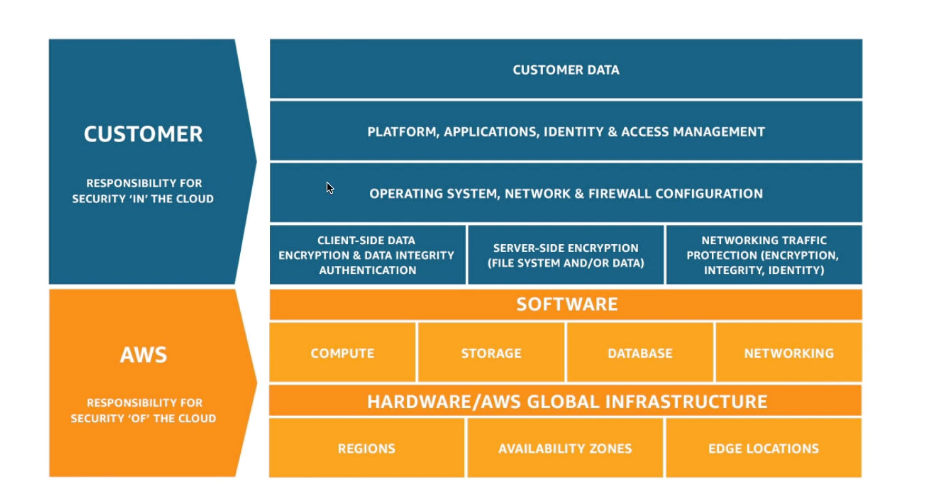

## AWS README PAGE 2

# DEPLOYMENT SCALE AND MANAGING INFRASTRUCTURE

## CLOUD FORMATION

- **It is a declarative way of outlining AWS infrastructure**
- Benefits are:
    - **    **
    - Cost - Resource creation and termination can be automated
    - Generated diagram for our template
    - Leverage existing templates

## AWS CLOUD DEVELOPMENT KIT (CDK)
- Defining **cloud infrastructure using a familiar coding language**
- Code is **compiled into a cloudformation template**

## AWS ELASTIC BEANSTALK - PaaS
- Generally we make use of 3 tier for Web application, that is, ELB -> EC2 -> DB
- Elastic beanstalk is a **developer centric view of deploying an application to AWS**
- **BEANSTALK - PaaS**
- Here **developer is managing the code while AWS is responsible for deployments and managing**
- **ELASTIC BEANSTALK HAS ITS OWN HEALTH MONITORING** 

## AWS CODE DEPLOY
- It is a **HYBRID SERVICE - ONPREM AND CLOUD**
- It is a way to **deploy application automatically**
- It helps in **UPGRADING APPLICATIONS FROM V1 TO V2 IN FEW CLICKS**

## AWS CODECOMMIT
- It is a **code repository, using the git technology**
- CodeCommit is a way of **storing code before moving it to deployment in AWS**
- Private, secure

## AWS CODEBUILD
- **SERVERLESS**
- Build code in the cloud
- **Compile source code, test and the output which is a package can be deployed**
- **PAY FOR TIME USED TO BUILD THE CODE**

## AWS CODEPIPELINE
- **We can connect CodeCommit and CodeBuild using a CodePipeline**
- It is basis for **CI/CD**
- Code -> Build -> Test -> Deploy

## OVERALL WORKFLOW

## AWS CODE ARTIFACT

- Storing and retrieving these dependencies is called **ARTIFACT MANAGEMENT**
- **Developers and CodeBuild can retrieve dependencies from CodeArtifact**

## AWS SSM - SYSTEM MANAGER
- Manage **Fleet of EC2 instances in On-prem and cloud**
- It is **HYBRID**
- We can do **AUTOMATED PATCHING**
- We need to install **SSM agent in EC2**

## AWS SSM Parameter Store
- **SERVERLESS**
- **Secure storage for configuration and secrets**
- **Version tracking and encryption is there**

# GLOBAL INFRASTRUCTURE 
- Deploying application in multiple regions or Edge locations mkaing it a global application 
- Reasons:
    - Decreased Latency
    - Disaster recovery 
    - Attack protection

## AMAZON ROUTE 53
- It is a managed DNS(Domain name system)
- It helps find client reach their right destination by providing IP address

### ROUTING POLICIES:
1. **SIMPLE ROUTING POLICY**
- No health checks 
-  simple goes to DNS and gets the IP

2. **WEIGHTED ROUTING POLICY**
- We do have health-checks
-  allows us to distribute weights acorss multiple EC2 instances

3. **LATENCY ROUTING POLICY**
- Checks for user location and redirects user request to nearest server 

4. **FAILOVER ROUTING POLICY**
- we will have primary and Failover instances
- DNS performs a health check on primary and then routes to failover if primary is unhealthy 

## CLOUDFRONT OVERVIEW
- It is a CDN - CONTENT DELIVERY NETWORK
- it **caches the content across Points of presence or Edge locations**
- We get **DDoS protection**
- Cloudfront has origins like S3, so for the first time. Edge location gets from origin and stores in cache for the next times 

## AWS S3 TRANSFER ACCELERATOR
- Increase uploads and downloads for S3 bucket
- When we need to upload a file from Australia to a bucket in England, then during the process it gets uploaded to a edge location first and through a **internal network** it gets uploaded to bucket in England super fast

## AWS GLOBAL ACCELERATOR
- Here we leverage, **AWS internal network to optmize the route to our application**
- We access applications through **static IP**
- We **connect to an Edge location and from there we move internal**

## AWS OUTPOSTS
- It is about HYBRID CLOUD
- **Outposts are server racks that offers same AWS infrastructuree services on On-prem**
- **AWS will setup and manage**
- But we will be responsible for security of the server racks 

## AWS WAVELENGTH
- Able to deploy few AWS services on edge of 5G networks
- ultra-low latency through 5G networks

## AWS LOCAL ZONES
**EXTEND VPC's IN A REGION TO LOCAL ZONES**
- **Place AWS compute storage or databases closer to users**
- Extend your VPC to more locations **Extension of AWS regions**
- Basically, we can extend a local zone for a region and then host our EC2 there for better latency and availability

# CLOUD INTEGRATIONS
- There are 2 ways of application communicating eachother:
    1. Synchronous communication (Application to Application)
    2. Asynchronous/Event based (Application -> Queue -> Application)

## AWS SQS
- SQS = Simple Queue Service
- Producers send messages to Queue and once it is stored in queue, consumer can poll these messages and complete the work
- Once completed, the message will be deleted in the queue
- **SERVERLESS**
- It is used to **DECOUPLE APPLICATIONS**
- default retention is **4 days to 14 days**
- **It used FIFO - FIRST IN FIRST OUT**
- Example:

## AWS KINESIS DATASTREAM
- It is used to **collect and analyze live streaming data**

## AWS SNS
- SNS = Simple notification service
- Sending a single message to thousands of users
- **PUB/SUB INTEGRATION**
- Publishers will send messages to **SINGLE SNS TOPIC** and **SUBSCRIBERS TO THAT SNS TOPIC** will get message from that 

## AMAZON MQ
- **SQS and SNS are cloud native**
- **On-Prem** makes use of **MQTT** etc.
- so **when migrated to cloud, to continue with those servers we make use of AMAZON MQ**

# CLOUD MONITORING 

## CLOUD WATCH METRICS
- Metrics are variable to monitor 
- metrics will have timestamps
- We can look at:
    - CPU utilization 
    - Status checks
    - Network

## AWS CLOUDWATCH ALARMS
- Trigger a cloud watch alarm for any metric 
- Alarm actions:
    - Auto scaling 
    - EC2 actions 
    - SNS notifications 
- We can create a billing alarm 

## CLOUDWATCH LOGS
- It is used to collect log files
- We can collect logs from:
    - EBS
    - ECS
    - Route53
- We can also retention the logs 

### CLOUD WATCH LOGS FOR EC2
- By default it will not send we need to install agent and then we can send what logs needs to be sent '

## EVENT BRIDGE 
- **schdeule Cron Jobs**
- We can react to event occuring and also for a service happening 
- Example: Give a alert to security group if a user is logging in through a Root user

## AWS CLOUDTRAIL
- It **provides, governance, compliance and audit for AWS account** 
- Everything that is done in an account will be logged in cloudtrail.
- We can send this to **S3 or CloudWatch logs**

## X-RAY OVERVIEW
- Debugging in production inlcudes reading logs and making fix and re-deploying 
- AWS **X-ray can do tracing and give visual representation of each services and see where it is failing **
- We can:
    - Troubleshooting 
    - Pinpoint service
    - Find errors and services
    - Identify users who are going to be impacted 

## AWS HEALTH DASHBOARD - SERVICE HISTORY
- Gives a health check on **AWS services across all regions **

## AWS HEALTH DASHBOARD - YOUR ACCOUNT 
- It provides alerts and remediation whe AWS is performing certain actions that will be affecting services in our account 
- Gives alert on schedules maintainence from AWS etc

# VPC AND NETWORKING 

## IP ADDRESSES IN AWS
- IPv4 - 4.3 billion addresses
- Ipv6 - almost unlimited (3.4 * 10^38)
- EC2 instances get new IP everytime we start and stop - **PUBLIC IP ADDRESS**

**Private IPv4 **- It is not public and will be the same even if we stop and restart and cannot be accessed by internet
- ### ELASTIC IP - Gets a fixed public IPv4 address to a Ec2 instance

- IPv6 is free on AWS while EIP and Ipv4 charges 0.005$

## VPC - VIRTUAL PRIVATE CLOUD
- **It is linked to a region**
- **Subnets** - **Part of a VPC and it will be associated to a AZ**
- Here we can have:
    1. **Public Subnet** - accessed by public
    2. **Private subnet** - cannot be accessed by public 

## INTERNET GATEWAY
- Helps **VPC** to connect to internet

## NAT GATEWAY
- allows **instances** to connect to internet using NAT GATEWAY
- NAT GATEWAY - converts private IP to public IP 

## NACL AND SECURITY GROUPS
1. ## NACL 
- **It is at VPC level**
- can allow or deny rules 
- they are not stateful 

2. ## SECURITY GROUPS
- **It is at instances level**
- **they are stateful**
- support allow rules, everything else is explicitly denied**

## VPC FLOW LOGS AND VPC PEERING 
- We can get:
    - VPC flow log
    - Subnet flow log
- This can be used for debugging networking issues 
- It can go to S3 or cloudwatch logs

## VPC PEERING
- connecting 2 VPC's privately using AWS network
- Must not have **overlapping CIDR**
- VPC peering is not **TRANSITIVE IN NATURE**

## VPC ENDPOINTS
- Endpoints allow you to **connect to AWS services using a private network**
- It ensures we have:
    - Better security 
    - low latency 
- ### VPC ENDPOINT GATEWAY IS FOR S3 AND DYNAMODB ALONE FOR OTHERS IT IS VPC ENDPOINT INTERFACE

## AWS PRIVATELINK 
- **It is the most secure and scalable way to expose a service to thousands of VPC's**
- **It allows service running in your VPC exposed to other VPC's**

## SITE TO SITE VPN
- **Connecting On-Prem Data centre to VPC on AWS we use SITE TO SITE VPN**
- It goes over public internet 
- We need **CUSTOMER GATEWAY** ON **CUSTOMER SIDE** and **VIRTUAL PRIVATE GATEWAY** on AWS side

## DIRECT CONNECT
- Establish a physical connection between On-Prem and AWS
- But more **private and secure and expensive **

## AWS CLIENT VPN
- connect your computer using **OpenVPN** to your VPC
- It goes over to internet and if VPC is connected to On-prem we can access On-prem as well 

## TRANSIT GATEWAY
- It helps in **connecting thousands of VPC's**
- **VPC PEERING WAS TOO HECTIC AND CREATED COMPLEX NETWORK TOPOLOGY** and hence we used Transit Gateway

# SECURITY AND COMPLIANCE

## AWS SHARED RESPONSIBILITY MODEL
- AWS is responsible for security **of** the cloud 
- Users responsible is for security **in** the cloud 
- AWS
    - managed services like S3, dynamoDb

- USERS
    - OS patchonog and IAM 
    - encryption

## WHAT IS A DDOS ATTACK
- Distributed denial of service
- Attacker launches master servers and these will create bots and these bots will send millions of requests
- We can tackle using:
    - AWS SHIELD STANDARD - free
    - AWS SHIELD ADVANCED 24/7
    - AWS WAF - Filter certain type of requests

## AWS SHIELD
- Generally on Layer 3 and Layer 4
- We have:
    - **Shield standard** - free
    - **Shield advanced **- 3000$ per month

## AWS WAF
- Protects web application from web exploits on **layer 7**
- we define Web ACL rules to protect us from attacks 
- Protects from SQL injection etc.

## AWS NETWORK FIREWALL

- Give protection from Layer 3 to layer 7
- It takes complete control of:
    - VPC to VPC traffic
    - Outbound to inbound 
    - inbound to outbound 
    - Direct connect & site to site VPN
    
## AWS FIREWALL MANAGER
- **Centralized place for managing all security groups in our infrastructure**
- We can manage:
    - VPC security groups
    - WAF rules
    - AWS shield Advances
    - AWS network firewall

## PENETRATION TESTING
- Attack our own infrastructure to check security in our cloud

## ENCRYPTION WITH KMS AND CLOUDHSM
- We have 2 types:
    - Encryption at rest (Data at rest) - S3, EFS, DB
    - Encryption in transit - Data in transit - moving data from On-prem to AWS

## AWS KMS
- KMS - Key management service
- We don't have keys and **AWS will manage but we define who can access it**

## CLOUDHSM
- We manage the **encryption KEYS** here, AWS gives the **encryption hardware**
- HSM - HARDWARE SECURITY MODULE

## TYPES OF KSM
1. ### CUSTOMER MANAGED KEY
- **created and managed by customer.**
- Customer can enable or disable 

2. ### AWS MANAGED KEY
- **Created and managed by AWS behalf of customer**
- `aws/` - means managed by AWS

3. ### AWS OWNED KEY
- collection of CMK's that is managed by AWS to use in multiple accounts

4. ### CLOUDHSM KEYS
- Keys that are created from our own CLOUDHSM hardware

## AWS CERTIFICATE MANAGER
- Manage and deploy **SSL and TLS certifcates**
- Used to provide **encryption for websites (HTTPS)**
- Supports both **public and private TLS certificates**

## AWS SECRET MANAGER
- To **store secrets**
- We can **force the rotation every X** number of days 
- It will e**ncrypted by making use of KMS**
- We can store secrets for a service like RDS etc.

## AWS ARTIFACTS OVERVIEW 
- Portal that gives access to **compliance reports**
- we get:
    - Artifact reports
    - artifact agreements

## AWS GUARDDUTY 
- It helps **Intelligent Threat discovery**
- Uses **Machine learning and 3rd party data**
- It looks after the CloudTrail Events logs, VPC flow logs, DNS logs etc and performs the actions
- We can also input optional logs like S3 logs, EBS logs, Lambda network activity etc

## AWS INSPECTOR OVERVIEW
- Automated security assessments on:
    - Vms leveraging SSM
    - Amazon ECR
    - Lambda functions 
- It will check for **vulnerabilities**
- It can generate** reports or report in AWS security Hub**
- Generates a **Risk score for prioritization**

## AWS CONFIG
- Helps in **auditing and recording compliance of AWS resources**
- We can see **if our changes are complient or no over time **
- It can be stored to S3 
- We can aggregate over all the resources and accounts 

## AMAZON MACIE
- **Discover and protect sensitive data using ML **
- PII - Personally identifiable information (PII)

## AWS SECURITY HUB 
- It is a** central security tool** to **manage and automate security checks around AWS infrastructure** 
- Partners with tools:
    - AWS firewall
    - AWS system manager
    - Inspector
    - WAF 
    - Macie
    - config
    - Health and many more 

- And we can see them in our dashboard 

## AMAZON DETECTIVE
- It is used to analyze the** Root cause of security findings **
- It makes use of **graph and ML**

## ROOT USER PRIVILEGES
- Root user = Account owner
- Some actions are performed by Root user:
    -   Change account name and password
    - Close AWS account 
    - view tax and invoices
    - Sell Reserved instances in marketplace
    - Change or cancel AWS support plan 
    - S3 bucked to have MFA
    - signup for GovCloud

## AWS IAM ACCESS ANALYZER
- Find out resources that are shared externally
- Zone of trust = AWS account or for AWS organization 
-  If it is out of Zone of Trust, then we will be notified 

# MACHINE LEARNING 

## AMAZON REKOGNITION
- It is used to **recognise text, image and scenes and videos using ML**
- Images can be reecognuised and labeled.
- Face detection analysis 

## AMAZON TRANSCRIBE 
- Automatically **convert speech to text**
- We can **automatically remove PII** and it is called **readaction**

## AMAZON POLLY
- Automatically converts **text to speech**

## AMAZON TRANSLATE
- **Language translation **

## AMAZON LEX & CONNECT
- Amazon lex powers **ALEXA**
- We get **ASR - Automatic speech recognition** and convert speech to text

- **Amazon connect**, create flows like recevieve calls and virtual connect 
- we can connect to **CRM**

## AWS COMPHREHEND
- It is for NLP -**Natural Language Processing**
- Use ML to find **insights and relationships in text **
- Use case: Understand customer emails etc.

## AWS SAGEMAKER
- Fully managed service for **developers to build ML models**
- We build the model using historical data and then we have to train and tune it and this will be managed by sagemaker

## AWS KENDRA
- Fully managed **document search** 
- We can find **certain texts from a document**
- It makes use of indexing

## AMAZON PERSONALIZE
- Real time ML-service to provide personalized recommendations 
- Used by e-commerce and amazon itself

## AMAZON TEXTRACT
- It is used to **extract text** from any scanned copy

# ACCOUNT MANAGEMENT AND BILLING

## AWS ORGANIZATION
- **GLOBAL SERVICE**
- **Manage multiple accounts**
- uses:
    - Consolidated Billing 
    - Pricing benefits from aggregated usage 
    - **Reserved instances can be pooled to multiple account** 
    - **Restrict account privilges using SCP**

- **ROOT OU - Master account** and we can have miultiple later

## SERVICE CONTROL POLICIES
- **SCP can be applied at OU or account level and they are IAM restrictions**
- **SCP CANNOT BE APPLIED FOR MASTER ACCOUNT** 
- SCP must have **EXPLICIT ALLOW**

## CONSOLIDATED BILLING
1. ### IT GIVES COMBINE USAGE
    - Combine usage across all AWS accounts
2. ### ONE BILL
    - Gives a single bill

## AWS CONTROL TOWER
- Easy way to s**etup and govern secure and compilant multi-account AWS environment**
- We **can automate the multi-account** 
- We can **detect policy violations**

## AWS RESOURCE ACCESS MANAGER
- **We can share resources from one account to another within or out of AWS organizations**
- Example: WE can share VPC between 2 accounts

## AWS SERVICE CATALOG
- Self service portal to launch a set of resources that are pre-approved by admins 
- Users gets a **product list** of resources they can create from this 

## PRICING MODELS IN AWS
1. PAY-AS-YOU-GO
2. SAVE WHEN YOU RESERVE - Long term requirements
3. PAY LESS BY USING MORE
4. PAY LESS AS AWS GROWS

## LAMBDA
- **Pay per call**
- **Pay per duration** 

## S3
- **Number and size of objects** 
- **Number and type of requests**
- **Data transfer OUT of the S3 region** 

## EBS
- volume type
- store volume in GB per month
- Number of snapshots

## RDS
- Depends on size, engine and memory class
- **Per hour billing**
- Backup storage is free
- Number of input and output requests per month 

## NETWORKING COST
- Inbount to EC2 is free
- EC2 talking to each other in same AZ - FREE
- EC2 talking to different AZ - Public IP - 0.02$
- EC2 talking to different AZ - private IP - 0.01$

## SAVINGS PLAN 
- commit to a certain $ for 1 to 3 years
- EC2 saving plan - 72% discount 

### COMPUTE SAVING PLAN
- 66% discount copared to On-Demand 

## AWS COMPUTE OPTIMIZER
- Reduce costs and improve performance by recommending optimal AWS resources

## BILLING AND COSTING TOOL

1. ### AWS PRICING CALCULATOR
- **ESTIMATE COST FOR SOLUTION ARCHITECTURE WE HAVE**

2. ### BILLING DASHBOARD
- Show all the **cost for the month and also forecast**

3. ### COST ALLOCATION TAG
- Allow to track AWS cost on detailed level 
- Used to organize resources
- **AWS generated tags** - Generated by AWS
- **USER-DEFINED TAGS** is also available 

4. ## COST AND USAGE REPORTS
- **Deep diver in costing** 
- AWS cost and usage data 
- It can be done for IAM users for hour dat etc
- **This can be integrated to athena** 

5. ## COST EXPLORER - FORECAST
- visualize, understand and manage AWS costs over time 
- It can be done hourly, weekly monthly
- **FORECAST TOOL FOR 12 MONTHS**

## MONITORING COSTS IN CLOUD

## BILLING ALARMS IN CLOUDWATCH
- It is stored only in **`us-east-1`**

## AWS BUDGETS
- s**end alarm when cost and forecast exist budget**
- It ha 4 types:
    - Usage
    - Cost
    - Reservation 
    - Savings plans 

- UPTO 5 SNS NOTIFICATION PER BUDGET 

## AWS COST ANOMALY
- **Use ML to watch billings and then alert when unsual billing happens**
- It will **send Anomaly report with Root cause**

## AWS SERVICE QUOTAS
- Notify when you're close to a service quota threshold
- We can create cloudwatch alarm 
- Example: Give me a alert when Lambda function hits 1000 triggers in a day 

