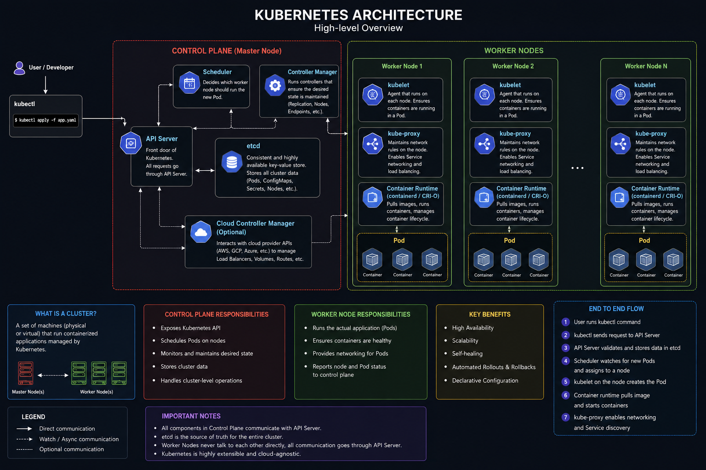

# KUBERNETES

## WHY DO WE NEED K8S WHEN WE HAVE DOCKER?
- Docker is excellent for packagig and running containerized applications. It works well when we are running 10 containers. However, at an organizational level, companies may run hundreds and thousands of containers across multiple servers. Managing them would be hard and that is reason why we need an orchaestration tool like k8s.
- k8s can also manage other things which docker cannotl;
    1. Automatic scaling 
    2. Self healing 
    3. Load balancing 
    4. Service discovery -  so applications can communicate 
    5. rolling updates and rollbacks
    6. scheduling 
    7. high availability
    8. configuration and secret management 

## K8S ARCHITECTURE

1. ### KUBERNETES CLUSTER
- A Kubernetes cluster is a group of machines (servers) that work together as a single platform to run containerized applications

2. ### NODES: 
- Nodes can be anything they can be a physical server, a VM or even a clous instance like a EC2 instance etc.

3. ### CONTROL PLANE:
- Control plane is the brain of the cluster.
- Control plane is responsible for making decisions which will then be passed on to the worker nodes 

1. ## COMPONENT 1 - API SERVER
- It is the most important component of the entire k8s architecture
- **Every single communication inside the k8s goes through API server"**
```
kubectl
      │
      ▼
+----------------+
|   API Server   |
+----------------+
      │
      ├──────── Scheduler
      ├──────── etcd
      ├──────── kubelet
      └──────── Controller Manager
```
- **Every request goes through API server**
- Responsibilites of API Server are:
    1. Recieve requests
    2. Authentication - token, OIDC etc.
    3. Authorization - Are you allowed to do this 
    4. Validation - not accept `replicas: -5`
    5. Store cluster state in etcd

- **API Server is a central management component and is the front door of the k8s control plane. It exposes the k8s API, recieves request, authentication, authorization, validation and also update the cluster state in etcd and coordinate communication between clusters**

2. ## COMPONENT 2 - ETCD
- **etcd is a distributed key-value database that stores the entire state and configuration of the k8s cluster**
- It's not SQL, its not PostgreSQL, its k8s own internal db 
- etcd is responsibel for storing:
    1. pods
    2. nodes
    3. deployments
    4. services
    5. secrets
    6. configmaps
    7. namespaces
    8. RBAC 
- if etcd goes down k8s cannot create pods, scale and do any operation without knowing the current state of the k8s 

3. ## COMPONENT 3 - SCHEDULER
- It answers one best question - A new pod needs to be created and which worker or node is in the best place to accomodate it
- This is decided considering variouds factors like:
    1. Available CPU
    2. Available memory
    3. Node Health
    4. Scheduling rules 
